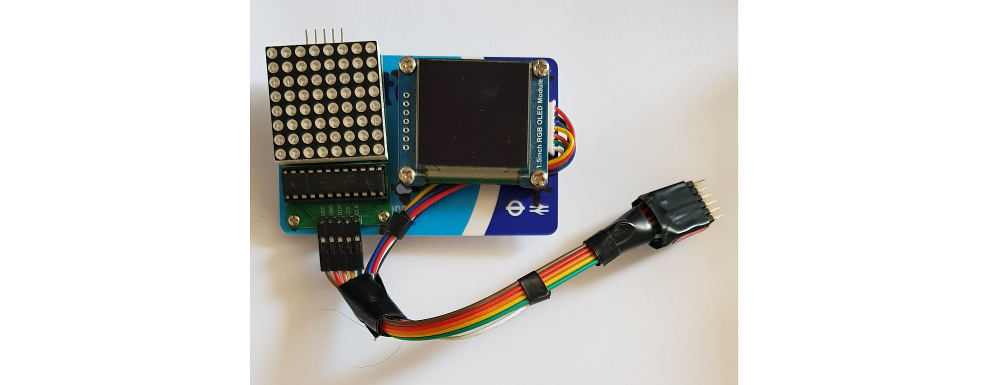
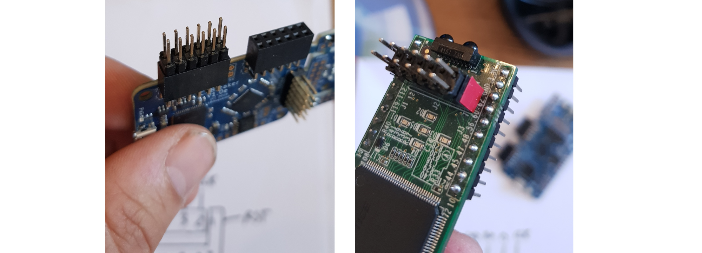

Oyster PMOD
===========

Create your own OysterPMOD, with a 8x8 led matrix, and a 128x128 OLED
display ! It can be assembled without any soldering. It is compatible 
with all femtorv processors and supported boards, and uses a single 
PMOD connector.

You will need:
- an old plastic card (Oyster card, credit card ...)
- a MAX7219 driven 8x8 led matrix (costs around $2)
- a SSD1351 128x128 oled display (costs around $10 - $15). You may find 
  cheaper clones, but they are sometimes reported not working.
- female-female dupont connecting wires for the led matrix
- connecting wires for the OLED display (most of the time they are
  shipped with it)
- small screws
- a 2x6 pins header (or two 1x6 headers)

Step 1
------
  - drill holes in the plastic card
  - attach the led matrix and the OLED display to the plastic card

Step 2
------

Insert the 2x6 pins header in the PMOD. The image shows what it looks
like on the IceBreaker (left) and IceStick (right). On the IceStick, 
I like to stick a tiny rectangle of red adhesive tape to indicate where 
the number 1 pin is.

Step 3
------

Connect the wires of OLED screen to the headers as indicated on the
diagram. Use 5 female-female dupont wires to connect the led matrix. 
Wonderful ! Both exactly fit in a single PMOD connector.

Step 4
------

Use adhesive tape to fix the 12 wires together. Add a tiny rectangle of
red tape to indicate number 1 pin. Your Oyster PMOD is ready to be
used ! If you have multiple FPGA boards, with a bit of care, it is
quite easy to have a single Oyster PMOD and connect it / disconnect
it multiple times (without having to connect all wires one by one). 

